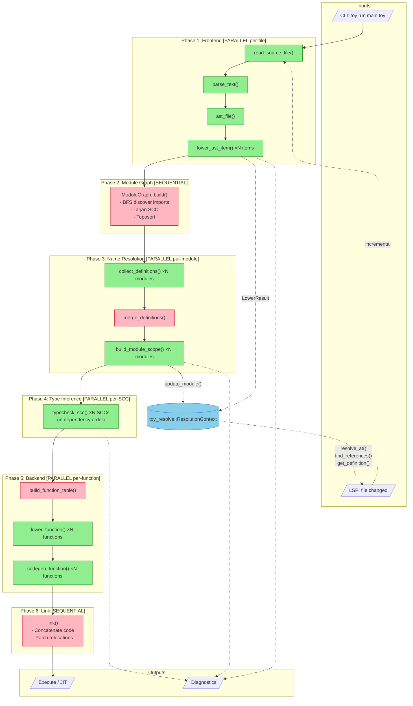

```mermaid
flowchart TB
      subgraph Inputs
          CLI[/"CLI: toy run main.toy"/]
          LSP[/"LSP: file changed"/]
      end

      subgraph "Phase 1: Frontend [PARALLEL per-file]"
          direction TB
          P1_READ["read_source_file()"]
          P1_PARSE["parse_text()"]
          P1_AST["ast_file()"]
          P1_HIR["lower_ast_item() ×N items"]

          P1_READ --> P1_PARSE --> P1_AST --> P1_HIR
      end

      subgraph "Phase 2: Module Graph [SEQUENTIAL]"
          P2_GRAPH["ModuleGraph::build()
          - BFS discover imports
          - Tarjan SCC
          - Toposort"]
      end

      subgraph "Phase 3: Name Resolution [PARALLEL per-module]"
          direction TB
          P3_COLLECT["collect_definitions() ×N modules"]
          P3_MERGE["merge_definitions()"]
          P3_RESOLVE["build_module_scope() ×N modules"]

          P3_COLLECT --> P3_MERGE --> P3_RESOLVE
      end

      subgraph "Phase 4: Type Inference [PARALLEL per-SCC]"
          P4_TC["typecheck_scc() ×N SCCs
          (in dependency order)"]
      end

      subgraph "Phase 5: Backend [PARALLEL per-function]"
          direction TB
          P5_TABLE["build_function_table()"]
          P5_MIR["lower_function() ×N functions"]
          P5_CODEGEN["codegen_function() ×N functions"]

          P5_TABLE --> P5_MIR --> P5_CODEGEN
      end

      subgraph "Phase 6: Link [SEQUENTIAL]"
          P6_LINK["link()
          - Concatenate code
          - Patch relocations"]
      end

      subgraph Outputs
          EXEC[/"Execute / JIT"/]
          DIAG[/"Diagnostics"/]
      end

      %% Main flow
      CLI --> P1_READ
      P1_HIR --> P2_GRAPH
      P2_GRAPH --> P3_COLLECT
      P3_RESOLVE --> P4_TC
      P4_TC --> P5_TABLE
      P5_CODEGEN --> P6_LINK
      P6_LINK --> EXEC

      %% LSP integration points
      LSP -.->|"incremental"| P1_READ
      P1_HIR -.->|"LowerResult"| LSP_CACHE[(toy_resolve::ResolutionContext)]
      P3_RESOLVE -.->|"update_module()"| LSP_CACHE
      LSP_CACHE -.->|"resolve_at()
      find_references()
      get_definition()"| LSP

      %% Diagnostics flow
      P1_HIR -.-> DIAG
      P3_RESOLVE -.-> DIAG
      P4_TC -.-> DIAG

      %% Styling
      classDef parallel fill:#90EE90,stroke:#228B22
      classDef sequential fill:#FFB6C1,stroke:#DC143C
      classDef lsp fill:#87CEEB,stroke:#4169E1

      class P1_READ,P1_PARSE,P1_AST,P1_HIR parallel
      class P3_COLLECT,P3_RESOLVE parallel
      class P4_TC parallel
      class P5_MIR,P5_CODEGEN parallel
      class P2_GRAPH,P3_MERGE,P5_TABLE,P6_LINK sequential
      class LSP_CACHE lsp
```
